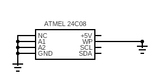

# Overview

The Arduino sketch provided here allows you to read data stored in an ATMEL 24C08 EEPROM microchip. This microchip is a serial EEPROM with a capacity of 1024 bytes organized in 128 pages of 8 bytes each. The sketch retrieves data byte by byte from the EEPROM and prints it to the Serial Monitor.

# How it works

The sketch initializes communication with the EEPROM using the Wire library, which facilitates I2C communication on the Arduino board. It then iterates through the memory addresses from 0 to 1023, reading each byte of data stored in the EEPROM and printing the address and corresponding value to the Serial Monitor.

The read() function is responsible for reading a byte of data from the EEPROM at a specified memory address. It begins by initiating a transmission to the EEPROM with the specified address, writes the data address to be read, and requests data from that address. If data is available, it reads and returns the byte; otherwise, it returns 0.
Usage

# To use this sketch, follow these steps:

Connect your Arduino board to the ATMEL 24C08 EEPROM microchip using the I2C protocol. Ensure that the SDA and SCL pins of the EEPROM are connected to the corresponding pins on the Arduino board.
Upload the provided sketch to your Arduino board using the Arduino IDE.
Open the Serial Monitor at a baud rate of 9600 to view the output.
The sketch will read each byte of data stored in the EEPROM and print the address along with its corresponding value.

# Dependencies

Wire Library: This sketch relies on the Wire library for I2C communication. Ensure that you include the Wire.h library in your Arduino sketch.

# Hardware requirements

    Arduino board (e.g., Arduino Uno)
    ATMEL 24C08 EEPROM microchip
    Jumper wires for connecting the Arduino board to the EEPROM

# Wiring circuit

To ensure seamless functionality, it is imperative to ground the NC (No Connection), A1, A2, and GND pins. The A1 and A2 pins, when grounded, serve to define the address configuration of the microchip. Furthermore, the SCL (Serial Clock) and SDA (Serial Data) pins must be meticulously connected to their corresponding counterparts on the Arduino board, ensuring a precise alignment of communication channels.

# Additional Notes

    This sketch assumes that the ATMEL 24C08 EEPROM is connected to the default I2C address 0x50. If you have configured a different address, modify the EEPROM_ADDRESS constant in the sketch accordingly.
    Ensure that the EEPROM is properly connected and powered before running the sketch.
